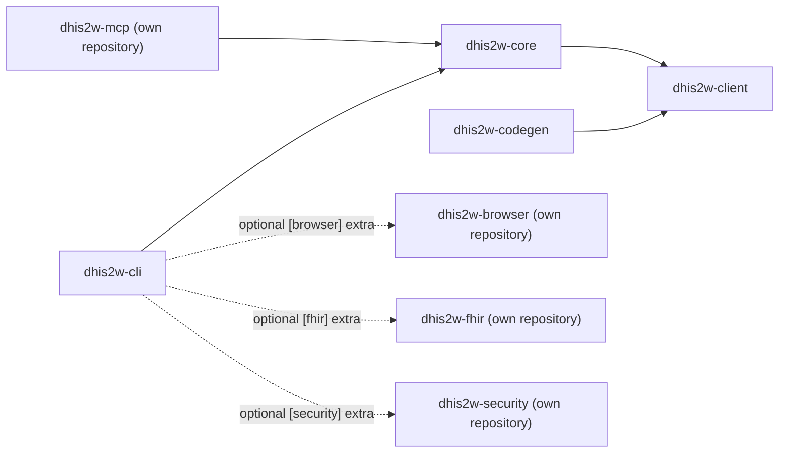

# Architecture overview

> **Learning path · step 7 of 8** — Design notes, limitations, future work. Prev: [API reference](../api/index.md). Next: [DHIS2_ISSUES.md](https://github.com/winterop-com/dhis2w/blob/main/DHIS2_ISSUES.md). Use this when you want to know *why* the codebase is shaped the way it is; the surface-tab Architecture pages cover individual plugins.

`dhis2w` is designed around **three orthogonal axes of extensibility**. Extending one should never force edits to another — that's how we keep this codebase maintainable as it grows.

## The three axes

### 1. Workspace members (shipping units)

Each shippable unit of code is a `uv` workspace member under `packages/`:

| Member | Role | PyPI |
| --- | --- | --- |
| `dhis2w-client` | Async DHIS2 API client + `Profile` model + `open_client(profile)` for PAT/Basic/session auth. | [`dhis2w-client`](https://pypi.org/project/dhis2w-client/) |
| `dhis2w-core` | TOML profile resolution, OAuth2 token store, plugin registry, first-party plugins. | [`dhis2w-core`](https://pypi.org/project/dhis2w-core/) |
| `dhis2w-cli` | Thin Typer console-script shell. | [`dhis2w-cli`](https://pypi.org/project/dhis2w-cli/) |
| `dhis2w-codegen` | Version-aware client generator. | _workspace-only_ |

The MCP surface is the [`dhis2w-mcp`](https://github.com/winterop-com/dhis2w-mcp) plugin pack, in a repository of its own: the `dhis2w-mcp` server, the single-tool `dhis2w-mcp-bridge` for small local models, and the `dhis2w-mcp-router` search + dispatch router, all published to PyPI at this workspace's version and documented at <https://winterop-com.github.io/dhis2w-mcp/>. The Playwright browser automation is the [`dhis2w-browser`](https://github.com/winterop-com/dhis2w-browser) pack, and the FHIR Implementation Guide tooling is the [`dhis2w-fhir`](https://github.com/winterop-com/dhis2w-fhir) pack (`dhis2w-fhir`, `dhis2w-fhir-serve`, `dhis2w-fhir-engine`, documented at <https://winterop-com.github.io/dhis2w-fhir/>), installed through the `dhis2w-cli[fhir]` extra.

New surfaces land as new members, or as a plugin pack in a repository of its own, with no edits required to existing ones.

### 2. Plugins inside `dhis2w-core`

Each DHIS2 domain (metadata, tracker, analytics, screenshots, indicator validation, …) is a self-contained plugin package in `dhis2w-core/src/dhis2w_core/v43/plugins/<name>/`. Every plugin is a folder with this shape:

```
<name>/
├── __init__.py        # exports `plugin = _MyPlugin()`, whose `contribute()` returns a `Contribution`
├── models.py          # plugin-internal pydantic view-models (reports, summaries, job state)
├── service.py         # async pure functions — single source of truth for the domain
├── cli.py             # Typer sub-app wrapping service.py
└── tests/
```

A plugin contributes its CLI module; its MCP tools are the [`dhis2w-mcp`](https://github.com/winterop-com/dhis2w-mcp) pack's `dhis2w_mcp/tools/v43/<name>.py`. The CLI command and the MCP tool both call into the same `service.py`. They never drift out of parity because neither is primary.

The plugin machinery is [pluginkit](https://pypi.org/project/pluginkit/): `load_plugin_host(version_key)` collects a `Contribution` from every plugin it can find, from two sources:

- **Built-ins** — iterate the plugin tree `resolve_startup_version()` picks at startup, `dhis2w_core.v43.plugins.*` on the default.
- **External** — the `dhis2w.plugins.v1` entry-point group. An external package (like the `dhis2w-fhir` pack) can add commands/tools without a PR.

### 3. Auth providers inside `dhis2w-client`

`dhis2w-client` defines an `AuthProvider` Protocol. The client never touches auth internals — it just asks for headers. Three providers ship with the package: `BasicAuth`, `PatAuth`, `OAuth2Auth`. Future providers (service-account JWT, OIDC federation, proxy-injected headers) land as new files in `dhis2w-client/auth/` without touching `client.py`.

## Dependency arrows



No cycles. `dhis2w-client` is the foundation everything builds on, which is what lets it ship to PyPI independently.

## Per-version subpackages

`dhis2w-client` and `dhis2w-core` are organised into per-major subpackages so each DHIS2 version (v41, v42, v43, v44) can evolve its own hand-written code without entangling the others:

```
dhis2w_client/{v41,v42,v43,v44}/        # hand-written client surface per major
dhis2w_client/generated/{v41,v42,v43,v44}/   # auto-generated wire types per major
dhis2w_core/{v41,v42,v43,v44}/plugins/  # plugin tree per major
```

v43 is the canonical baseline: new behaviour is written against the v43 tree first and copied to v41, v42, and v44 (the v44 preview), and the trees diverge per-file as version-specific quirks land (CategoryCombo COC regeneration on v43, the `categorys` -> `categories` rename, v41's missing `OAuth2ClientCredentialsAuthScheme`, etc.). The version-neutral `dhis2w-fhir` pack imports its generated models from `dhis2w_client.generated.v43.*`.

**When you add, rename, or remove anything,** apply the change to all four trees. New plugin commands ship as four plugin files; bug fixes that aren't version-specific land in all four. Examples are the exception — they ship as **one** file under `examples/{cli,client}/` (the MCP examples live in the `dhis2w-mcp` repository), because the wire is the same for almost everything they touch; only an example that exists for a single major lives under that major's subdirectory (`examples/client/v43/`). The CLAUDE.md hard requirements section spells this out at "Per-version subpackages" — the codebase enforces tree symmetry by convention, not by tooling, so the diff is the only check.

## Why this matters

Every time a new requirement comes in, we should be able to say "that's a plugin", "that's a new auth provider", or "that's a new workspace member" — and build it in isolation. If a new requirement forces edits across three members, the architecture is wrong.
